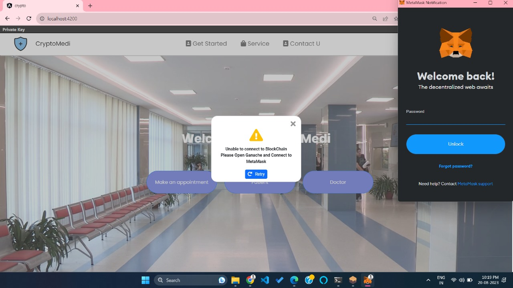

# Personal Medical Record Management Application

Welcome to the Personal Medical Record Management Application! This application aims to revolutionize the management of electronic health records (EHRs) by leveraging blockchain technology. The app focuses on addressing challenges related to interoperability and privacy in the healthcare sector, ensuring secure and efficient access to medical records.

## Table of Contents:
- [Introduction](#introduction)
- [Features](#features)
- [Getting Started](#getting-started)
  - [Prerequisites](#prerequisites)
  - [Installation](#installation)
- [Usage](#usage)
- [User Interface](#user-interface)
- [Integration](#integration)
- [Identity Management](#identity-management)
- [Search and Document Retrieval](#search-and-document-retrieval)
- [Document Sharing](#document-sharing)
- [Digitization of PHR Documents](#digitization-of-phr-documents)

## Introduction:
Traditional paper-based medical records are being replaced by electronic health records (EHRs) due to their efficiency and enhanced security. However, challenges such as interoperability and privacy concerns have arisen. The Government of India has initiated the National Digital Health Mission (NHDM) to tackle these challenges. This application, developed as part of the FlipKart GRiD initiative, utilizes a blockchain infrastructure to address interoperability, privacy, and data redundancy issues associated with EHRs.

## Features:

- Set up a blockchain infrastructure for:
  - Identity management
  - Medical records management
- User interfaces tailored for different stakeholders:
  - Clinic
  - Hospital
  - Individual Doctors
  - Diagnostics
  - Patient
- Integration of blockchain infrastructure with Health Stack
- Seamless integration with Abha ID and Aadhar for robust identity management
- Efficient document search using various criteria:
  - Date
  - Doctor
  - Document Type
  - Hospital Name
  - Patient Name
- Document sharing in different formats:
  - Image
  - PDF
- Streamlined digitization of Personal Health Record (PHR) documents

## Getting Started:

### Prerequisites:

- Node.js (version v18.17.0)
- npm (version 9.6.7)
- Blockchain SDK 
- Health Stack API 

### Installation:

1. Clone this repository: `https://github.com/subhamkumarr/FlipKart_Grid_5.0.git`
2. Navigate to the project directory: `cd EHR-2.0`
3. Install dependencies: `npm install`
4. Configure blockchain SDK with necessary credentials.
5. Configure Health Stack API credentials.

## Usage:

To start the application, run: `npm start`

## User Interface:

The application provides intuitive user interfaces for various stakeholders, including clinics, hospitals, doctors, diagnostics, and patients. Each user interface is tailored to the specific needs of the stakeholder, ensuring a seamless experience.

Here are a few screenshots to give you an idea of the user interfaces:

### Client Interface:

### Admin Interface:

### Doctor Interface:

### Patient Interface:

### Patient Registration Interface:

### Patient Appointment Interface:

### Doctor Registration by Admin Interface:

### Doctor List Interface:

## Integration:

The application seamlessly integrates with the Health Stack, enabling interoperability between different healthcare systems. This integration enhances data sharing and accessibility across the healthcare landscape.

## Identity Management:

Robust identity management is achieved through integration with Abha ID and Aadhar. This ensures that only authorized individuals have access to sensitive medical records.

## Search and Document Retrieval:

Efficiently search and retrieve relevant documents based on specific criteria such as date, doctor, document type, hospital name, and patient name. This feature streamlines data access and enhances decision-making.

## Document Sharing:

Users can share medical documents in various formats, including images and PDFs. This promotes collaboration among healthcare providers and facilitates information exchange.

## Digitization of PHR Documents:

The application provides a user-friendly interface for digitizing Personal Health Record (PHR) documents, reducing paperwork and enhancing data accessibility.

---

**By building this Personal Medical Record Management Application, we aim to revolutionize the healthcare industry by ensuring efficient, secure, and interoperable access to electronic health records. Your participation and contributions are crucial to achieving this vision. Let's make healthcare data management better together!**

